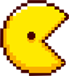
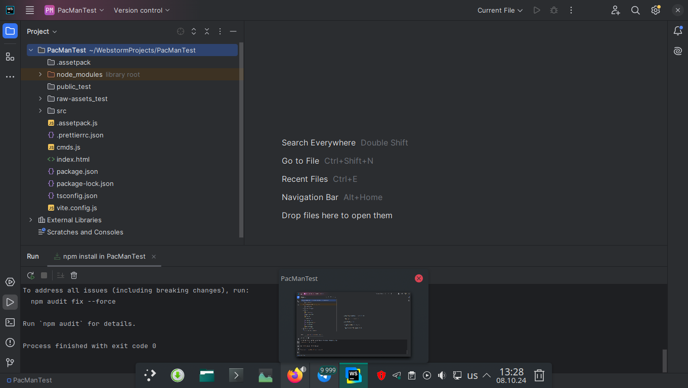
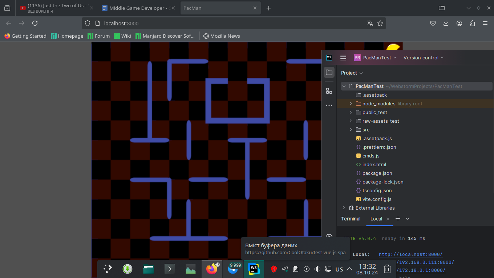
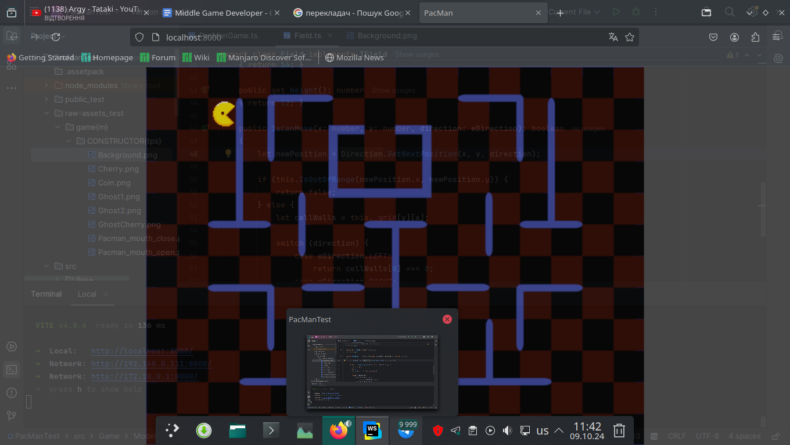
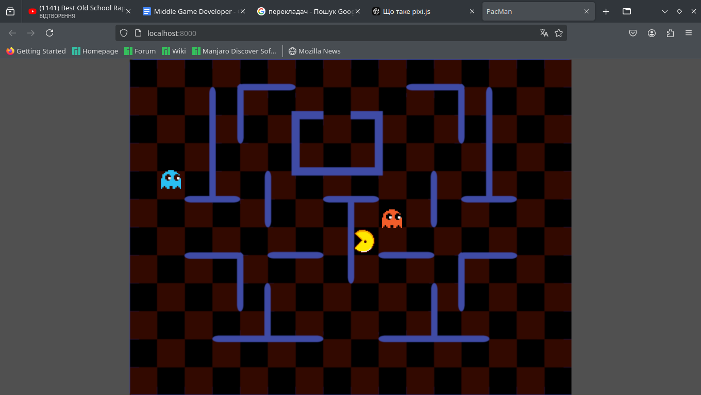
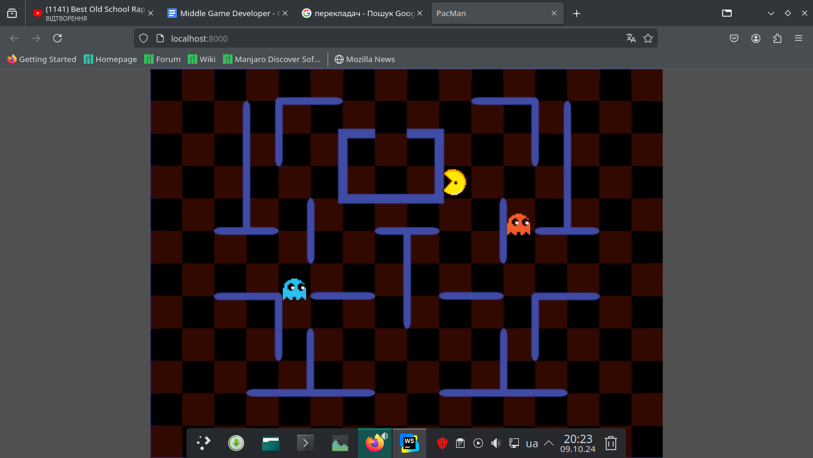
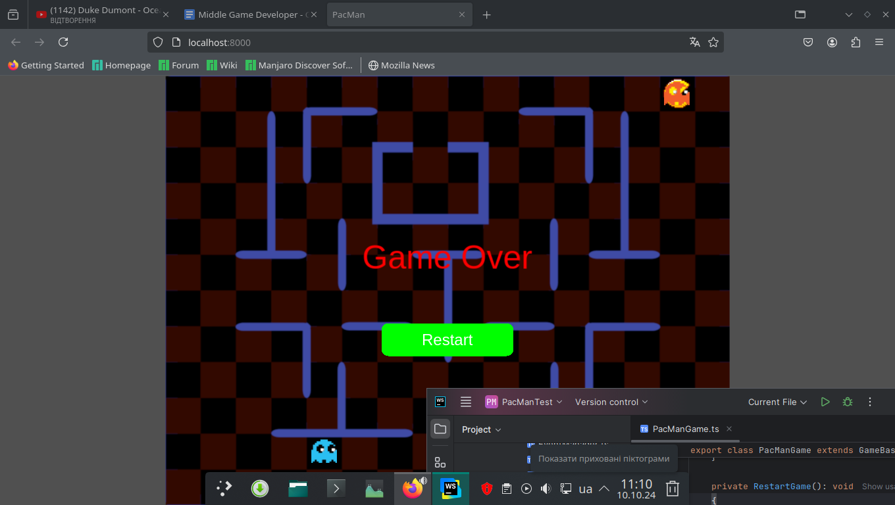

<p align="center"></p>
<h1 align="center">PacManTest</h1>

## Description
<b>EN:</b>

This web game was created as a test task for the **Middle Game Developer (PixiJS)** job.

Here I developed the well-known game **Pac-Man** using the **PixiJS** library.

The task sounded like this:

### Introduction
You have to finalize the existing project, implement part of the functionality of the Pac-Man game.
It is necessary to finalize the existing project, and not implement a new one based on other solutions.
The following technology stack is used: ***npm***, ***typescript***, ***pixi.js***, ***vite***.
Try to adhere to the ***code style*** and already established architecture.

### Description of elements

#### Field
The field consists of cells, where (0, 0) is the upper left corner.
Partitions between the cells should be organized on the field. Pacman and ghosts should not pass through them.

#### Pacman
Must move in a given direction until we change it or pacman hits a wall.
Changing the direction should be done using the arrow keys on the keyboard.

#### Ghost
At the start of the game, two ghosts should appear on the field.
Ghosts need to implement different behaviors.
- Ghost 1: randomly moves around the field.
- Ghost 2: Craves Pacman.

If the ghost touches Pacman, the game is lost.

<b>UA:</b>

Це веб ігра створена як тестове завдання для вакансії **Middle Game Developer (PixiJS)**.

Тут я розробив всім відому гру **Pac-Man** з використанням бібліотеки **PixiJS**.

Завдання звучало так:

### Вступ
Ви маєте доопрацювати існуючий проект, реалізувати частину функціоналу гри Pac-Man.
Необхідно саме доопрацювати існуючий проект, а не реалізовувати новий на основі інших рішень.
Використовується наступний стек технологій: ***npm***, ***typescript***, ***pixi.js***, ***vite***.
Намагайтеся дотримуватись ***code style*** і вже закладеної архітектури.

### Опис елементів

#### Поле
Поле складається з осередків, де (0, 0) – лівий верхній кут.
На полі потрібно організувати перегородки між осередками. Пакман і привиди не повинні проходити крізь них.

#### Пакман
Повинен рухатися в заданому напрямку, поки ми не змінимо його або пакман не впріться в стіну.
Зміна напряму повинна здійснюватись за допомогою клавіш-стрілок на клавіатурі.

#### Привид
При старті гри на полі мають з'являтися два привиди.
У привидів треба реалізувати різну поведінку.
- Привид 1: випадково переміщається по полю.
- Привид 2: прагне до пакмена.

Якщо привид стосується пакмена – гра програна.

#
## Screenshots
<p align="center">
  
  
  
  
  
  
</p>

#
## Technologies used
<b>EN:</b>
- Creating a game using the framework [**PixiJS**](https://pixijs.com/)
- Writing game code in [TypeScript](https://www.typescriptlang.org/)
- Using [**Vite**](https://vite.dev/) for frontend generation
- Using the ***MVC*** programming model

<b>UA:</b>
- Створення гри за допомогою фреймворку [**PixiJS**](https://pixijs.com/)
- Написання коду гри на [TypeScript](https://www.typescriptlang.org/)
- Використання [**Vite**](https://vite.dev/) для генерації фронтенду
- Використання моделі програмування ***MVC***

#
## License
```
© 2024, CoolOtaku (ericspz531@gmail.com)
```
